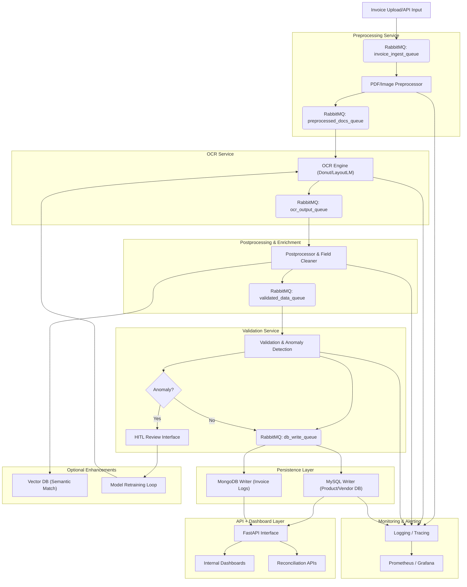

# Intelligent Invoice Processing Prototype


[](https://github.com/huamaiai/ocr.invoice.processing.git)

## 🎯 Project Objective

This project demonstrates a production-grade modular, decoupled system prototype for **intelligent invoice processing** — automating extraction, validation, correction, enrichment, and structured storage of invoice data from PDFs using AI and OCR. It supports structured data storage, searchable invoice history, FAISS-powered semantic search, and Human-in-the-Loop (HITL) corrections.

It helps reduce manual data entry, improves consistency in vendor billing, and enables better downstream analytics through structured invoice records.

## 🧠 How It Works

1. A PDF invoice is uploaded via Streamlit (or API).
2. It’s converted to images and processed via OCR (Tesseract for now, Donut-ready).
3. Parsed text is validated for anomalies (e.g. mismatched totals).
4. Data is stored in MongoDB (raw OCR logs) and MySQL (structured fields).
5. Optionally, a human reviews/corrects fields via a browser interface (HITL).
6. Line items are semantically matched to product catalogs using FAISS and sentence-transformers.

## ✅ Test Plan

| Test | What to Check | How |
|------|---------------|-----|
| Upload & OCR | OCR extracts readable text | Upload sample PDF |
| HITL UI | Edited data is submitted | Fill fields and submit |
| MySQL | Data is stored in `cleaned_invoices` | Connect via CLI or GUI |
| MongoDB | Raw OCR is logged | Connect and inspect `raw_ocr_logs` |
| Logging | Backend logs invoice submission | Check `uvicorn` log output |

## 🧪 Demo Walkthrough

1. Start all services:

   ```bash
   docker compose up --build
   ```

2. Visit Streamlit at: [http://localhost:8501](http://localhost:8501)
3. Upload one of the PDFs in `data/sample_invoices`
4. Edit the vendor, date, total
5. Click **Submit**
6. Use MySQL / MongoDB CLI or GUI to confirm data is saved
7. Watch the terminal for backend logs

## ⚛️ Optional: React Migration Plan

You can replace Streamlit with React for a production-ready frontend.

Steps:

1. Scaffold a React app in `frontend/`:

   ```bash
   npx create-react-app hitl-ui
   ```

2. Rebuild HITL fields using controlled React components
3. Use Axios or fetch() to call:
   - `/upload-invoice` (for OCR preview)
   - `/submit-cleaned` (for final submission)

4. Style with Tailwind CSS or MUI
5. Replace Streamlit service in Docker Compose with:

   ```yaml
   build: ./frontend
   command: npm run start
   ```

> Streamlit is great for internal tools — React is better for production UI.

---

## 📦 Features

- PDF/scan invoice ingestion with OCR (Tesseract, Donut, LayoutLM-ready)
- Image and layout preprocessing with pdf2image + OpenCV
- Field-level extraction (vendor, items, totals)
- Validation rules for anomaly detection (tax, totals, mismatched line items)
- MySQL for structured invoice records
- MongoDB for raw OCR logs and audit trail
- FAISS vector search for semantic line-item and product mapping
- HITL support for corrections via editable UI
- FastAPI backend for orchestration and APIs
- Docker-based development with `docker-compose`

### System Architecture Diagram



---

## 🖥️ System Requirements

Install these before running the project locally:

```bash
sudo apt update && sudo apt install -y \
  poppler-utils \
  tesseract-ocr \
  docker.io \
  docker-compose
```

---

## 🗂 Project Structure

```plain
invoice-processing/
├── backend/            # Core processing logic
│   ├── db/             # MySQL and MongoDB connections
│   ├── ocr/            # OCR processors, pre/post-processing
│   ├── hitl/           # HITL correction logic
│   ├── vector_search/  # FAISS + sentence-transformers
│   ├── main.py         # FastAPI entrypoint
│   └── utils.py
├── frontend/           # HITL interface (React or Streamlit)
├── data/               # Sample invoices, FAISS index
├── schema/             # MySQL schema
├── tests/              # Pytest-based unit and integration tests
|   └──test_ocr_processor.py
├── docker-compose.yml  # DB containers
├── .env                # Environment variables
├── .gitignore
├── requirements.txt    # Python dependencies
├── setup_instructions.sh  # Bootstrap script
└── README.md
```

---

## 🚀 Quick Setup

In this section:

> **Note**: This sets up a Python virtual environment, installs system dependencies, and runs Docker containers.

```bash
chmod +x setup_instructions.sh
./setup_instructions.sh
```

This script:

- Installs system dependencies (`poppler-utils`, `tesseract-ocr`)
- Sets up Python virtualenv and installs packages
- Launches MySQL and MongoDB using Docker

---

## ▶️ Running the App

Start the FastAPI server:

```bash
uvicorn backend.main:app --reload
```

(Optional) Start frontend HITL UI:

```bash
cd frontend
npm install
npm run dev
```

---

## 🧪 Running Tests

```bash
PYTHONPATH=$(pwd) pytest tests/
```

---

## 📌 Environment Variables (.env)

```env
COMPOSE_PROJECT_NAME=mostedge
MYSQL_ROOT_PASSWORD=rootpass
MYSQL_DATABASE=invoice_db
MYSQL_USER=invoice_user
MYSQL_PASSWORD=invoice_pass
MYSQL_DB=invoice_db

MONGO_HOST=localhost
MONGO_PORT=27017
MONGODB_URI=mongodb://localhost:27017
MONGODB_DB=ocr_logs

API_BASE_URL=http://localhost:8000
```

---

## 🧠 Semantic Matching (Vector Search)

- SentenceTransformer: `all-MiniLM-L6-v2`
- FAISS: Local similarity index
- Used to match invoice line items to structured product catalog entries

---

## 👤 Human-in-the-Loop (HITL)

- Manual review/edit interface for extracted OCR fields
- Feedback stored for future model retraining
- Option to approve/correct invoice-level output

---

## 🔧 Technologies Used

- Python, FastAPI, SQLAlchemy
- MySQL, MongoDB
- FAISS, SentenceTransformers
- Tesseract, OpenCV, pdf2image
- Docker, Docker Compose
- React / Streamlit (HITL UI)

---

## 🚀 Deployment on Railway

### Prerequisites

- [Create a Railway account](https://railway.app)
- Install [Railway CLI](https://docs.railway.app/develop/cli)

### Steps

1. Push your repo to GitHub
2. Go to [https://railway.app](https://railway.app) and create a new project
3. Connect your GitHub repo
4. Add two services:
   - `backend/` → Python (FastAPI) service
   - `frontend/` → Python (Streamlit) service
5. Add Railway-provided MySQL and MongoDB plugins
6. Set these environment variables:
   - `MYSQL_HOST`, `MYSQL_USER`, `MYSQL_PASSWORD`, `MYSQL_DB`
   - `MONGO_URI`, `MONGO_DB`
7. Deploy and visit your services via Railway domains

🔗 Tip: Use the “Deploy from GitHub” option for CI/CD

---

## 🧭 What's Next

- Add admin dashboard to review/edit invoice history and monitor system status
- Add user login/authentication (admin vs reviewer)
- Enable editing of line items, not just totals
- Add invoice format clustering and Donut fine-tuning
- Push corrections to retraining pipeline
- Add Slack/email webhook on new invoice submission
- Build analytics dashboard (monthly spend, top vendors)

## 🤝 Contributing

Feel free to fork and submit PRs! Suggestions, issues, and improvements welcome.

---

## 📜 License

MIT License
